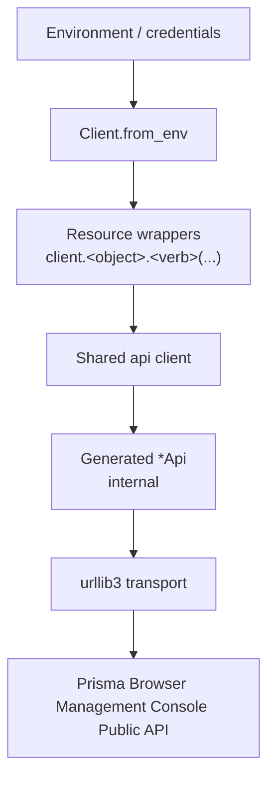

# Architecture

`prisma-browser-sdk` is a thin, typed layer over the Prisma Browser Management Console Public API REST API.

## The client

`Client.from_env()` builds one authenticated client. **Reuse a single client** across
requests — the first call mints an auth token that is then reused, so creating a client
per request is wasteful.

Each object is exposed as a typed **resource wrapper** attribute: `client.<object>`
(for example `client.application`). A wrapper exposes clean, verb-named methods —
`create(body=…)`, `get(id=…)`, `list(…)`, `update(id=…, body=…)`, `delete(id=…)` — that
return typed models. Several wrappers may share one backing API client under the hood;
the raw generated `*Api` classes are an internal detail you never call directly.

## Components

This SDK is assembled from these components:

| Component | Role |
|-----------|------|
| Resource wrappers | `client.<object>.<verb>(...)` — every object as a typed attribute with clean CRUD methods |
| Authentication | Injects credentials and refreshes the access token automatically |
| Pagination | `client.<object>.list(all_pages=True).data` walks every cursor page for you |
| Retry | Automatic retries with jittered backoff on transient failures |
| Errors | Normalised error messages extracted from API error bodies |

## Objects and operations

Each object is a typed wrapper exposed as `client.<object>`. Its methods are the clean
verbs for that object; the wrapper translates each call onto the appropriate backing
operation. Browse the full surface in the **[API Reference](reference/)**.

